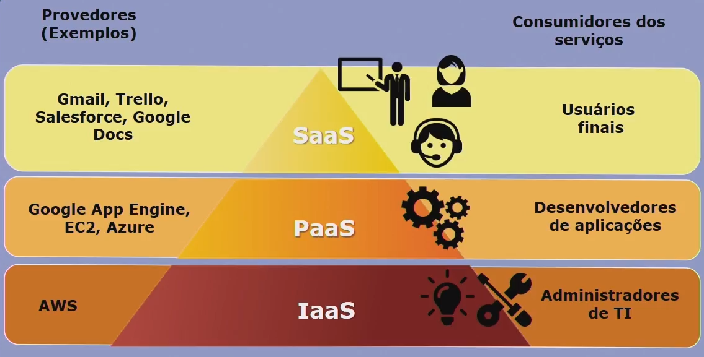
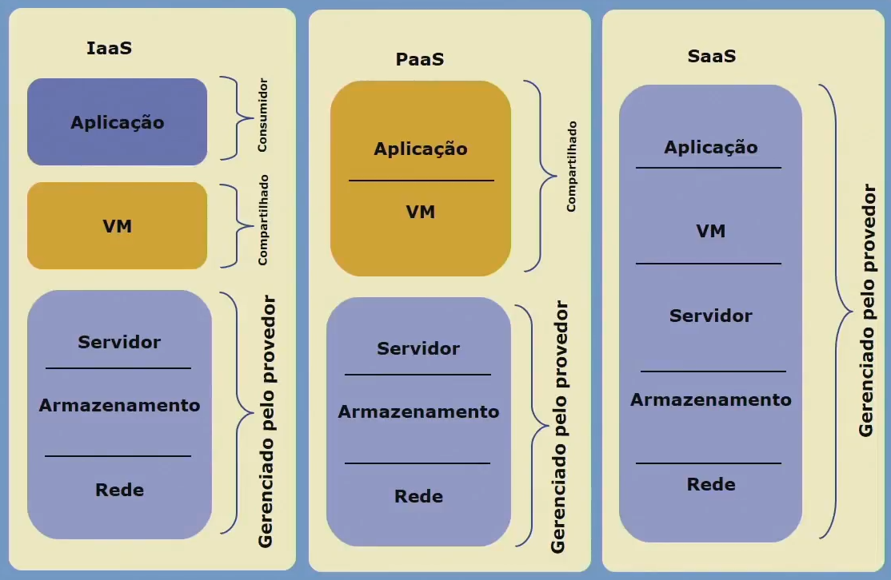
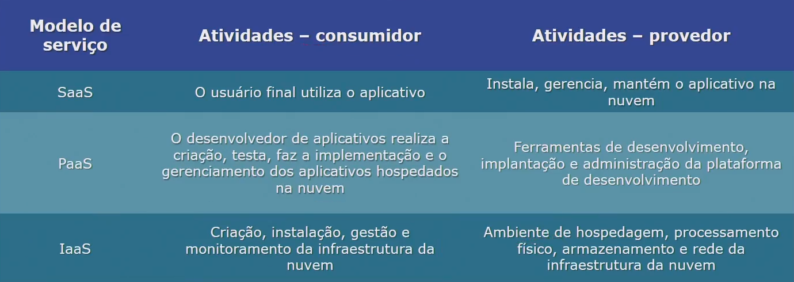
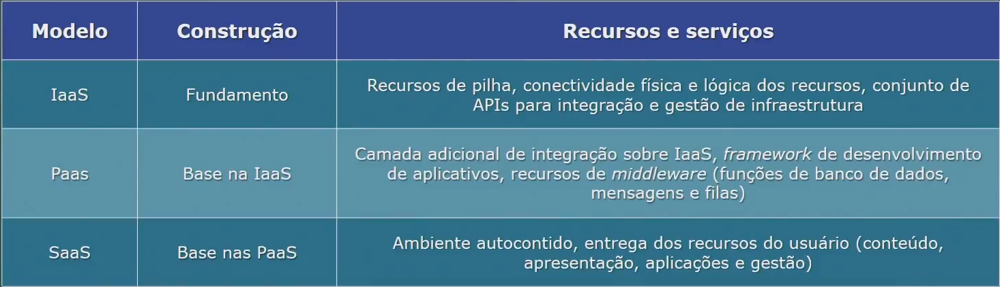

## Conceitos e aspectos gerais

- ItaaS - TI como serviço
- Serviços: servidores, armazenamento, banco de dados, ... Tudo que é feito localmente, oferecido em nuvem.

Computação em nuvem é o conjunto de recursos e serviços disponibilizados na intervet.

Caracteristicas essenciais:
- Autoatendimento
- Amplo acesso
- Elasticidade
- Serviços mensuráveis
- Compartilhamento de recursos

Benefícios: economia com fornecimento, demanda e multilocação.

## Modelos de serviço

### SaaS - Software as a Service
- Aplicativos utilizados pelos usuários finais
- Utilizados pela web/navegadores
- **Menor controle**
- Por exemplo: Google Drive, Gmail, Trello

### PaaS - Platform as a Service
- Aplicativos utilizados pelos usuários finais
- Disponibilidade de aplicação e comunicação entre aplicativos
- Suporta o SaaS
- Por exemplo: Google App Engine, EC2, Azure

### IaaS - Infrastructure as a Service
- Fornecimento de infraestrutura de processamento e armazenamento utilizado pelos administradores de TI
- Suporta PaaS e, portanto, SaaS
- **Maior controle**
- Por exemplo: AWS

## Modelos de implementação

### Nuvem privada
- Utilizada por uma única organização, podendo ser hospedada localmente ou terceirizada em uma rede fechada.
- Benefícios: Alta eficiência, disponibilidade, elasticidade e rápida implementação; Além disso, baixo custo, economia em escalabilidade, fácil gerenciamento;
- Risco de privacidade dos dados.

### Nuvem pública
- Utilizada por várias pessoas ou organizações, **sem limitação ou restrição**.
- Benefícios: Alta eficiência, disponibilidade, elasticidade e rápida implementação. Além disso, baixo custo, intregação fácil, controle de segurança, conformidade entre a qualidade do serviço e despesas;

### Nuvem comunitária
Utilizada por várias organizações **com limitação de acesso** para apenas as organizações e pessoas com o mesmo interesse, em uma rede fechada.

### Nuvem híbrida
Combinação de um ou mais modelos de nuvem.

## Arquitetura de referência NIST

### Atores

Provedores e Consumidores (Usuários finais, Desenvolvedores de aplicações, Administradores de TI)

Agentes de nuvem
- Intermediário (service intermediation): Aprimoramento do serviço, melhoramento do recurso.
- Agregação (service aggregation): Combinação e integração de vários serviços em um novo serviço.
- Arbitragem (service arbitrage): Flexibilidade para escolher serviços de vários provedores.

Auditores de nuvem
Garantem:
- Segurança
- Privacidade
- Desempenho

### Modelo de segurança CSA 

## Componentes da arquitetura

### Orquestração de serviços

- Camada de serviço (service layer)
- Camada intermediária (resourcer abstraction and control layer)
- Camada de recursos físicos (physical resource layer)

### Gerenciamento de serviços

- Suporte a negócios (business support management)
- Fornecimento e configuração (provision and configuration)
- Portabilidade e interoperabilidade (portability and interoperability)

### Domínios das áreas críticas de segurança

- Governança e Operacional

### Áreas de foco crítico

- Segurança tradicional, continuidade de negócios e recuperação de desastres
- Operação de centro de dados
- Resposta aos incidentes, notificação e correção
- Segurança de aplicações
- Criptografia e gerenciamento de chaves
- Gerenciamento de identidade e acesso
- Virtualização
- Segurança como um serviço (security as a service)

### Problemas de segurança

- Disponibilidade, viabilidade
- Recuperação de desastres e continuidade
- Transparência
- Perda de controle físico dos dados
- Aspectos legais e regulatórios